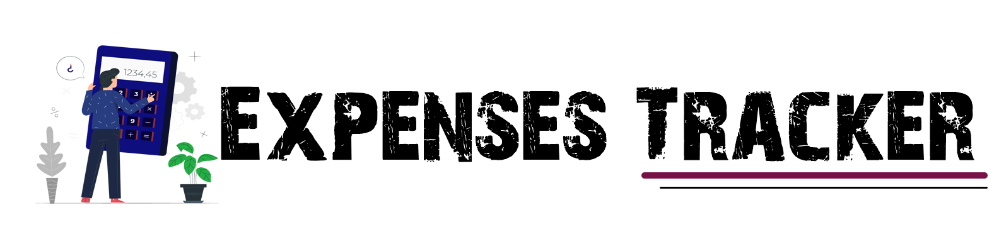
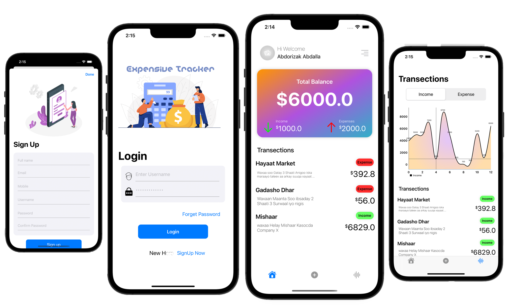

##### Expenses Tracker 🫰 is a financial app that used to track daily Expense from you Income

### Overview 🫵
- Every thing is programmatic UI, no storyboard.
- this app have user authentication either by username or pin number, it stores token in local storage.
- it displays your daily expenses and income in simple line chart.
- Expenses Tracker have a backend that is built with Node.js and mongoDB.

### Installation 🛠
- Clone / download this repository.
- change the bundle identifier in project settings.
- run the app.

## Screenshots 📸

### Fetures 📌
• 100% Swift. 
• programmatic UI. 
• Supports Iphone SE. 
• User Authentication. 
• Add Income and Expenses. 
• Display Income and Expenses in line chart with table uisng UISegmentedControl. 
• network request using URLSession async and await. with generic function. 

## Author 📝
**©** **Abdorizak Abdalla** **2022**
